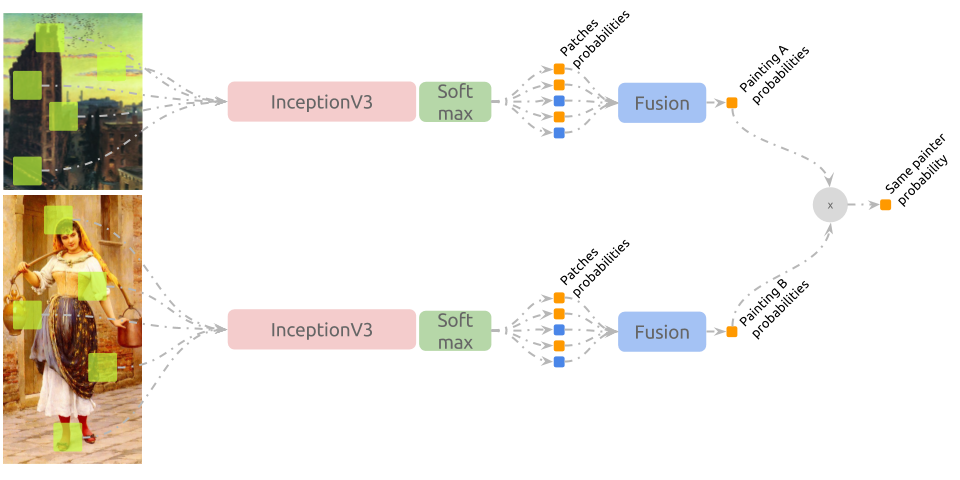

# Connoisseur

Machine Learning experiments on paintings.


“Battle of Grunwald”, Jan Matejko, 1878. From Public Domain.  
Available at: [wikiart.org/en/jan-matejko/battle-of-grunwald-1878](https://www.wikiart.org/en/jan-matejko/battle-of-grunwald-1878).

## Installation

### Straight Installation

The simplest way to install connoisseur is the following command:

```shell
$ cd /path/to/connoisseur
$ python3 setup.py install --user
```

As you are installing the package in a global environment, some
incompatibilities might happen.
Try [virtualenv](https://virtualenv.pypa.io/) if that's the case.

### Docker

This method is preferable, as I attached a Dockerfile in this repository.
An image build from the Dockerfile will spawn containers that already have
the correct dependencies to run the experiments.

To use it, build the image:

```shell
$ cd /path/to/connoisseur/docs/
$ docker build -t connoisseur-image .
```

Then run the container and install connoisseur:

```shell
$ nvidia-docker run -it --rm -v /path/to/connoisseur:/connoisseur \
    connoisseur-image /bin/bash
$ cd /connoisseur
$ python setup.py install
```

## Running the experiments

After entering the virtual environment or initiating the docker container,
experiments can be found at the `/connoisseur/experiments` folder. An
execution example follows:

```shell
cd ./experiments/
python 1-extract-patches.py with batch_size=256 image_shape=[299,299,3] \
                                 dataset_name='VanGogh' \
                                 data_dir="./datasets/vangogh" \
                                 saving_directory="./datasets/vangogh/random_299/" \
                                 valid_size=.25
```

This experiment will download, extract and prepare van Gogh's dataset into the
`data_dir` directory. Finally, it will extract patches from all samples and
save them in `saving_directory`.

Each experiment is wrapped by [sacred](http://sacred.readthedocs.io/) package,
capable of monitoring an experiment and logging its progression to a database
or file. To do so, use the `m` or `F` parameter:

```shell
python 1-extract-patches.py -m 107.0.0.1:27017:experiments  # Requires MongoDB
python 1-extract-patches.py -F ./extract-patches/
```

## Reportage

### van Gogh's

van Gogh's dataset is composed by 264 train samples and 67 test samples,
discriminated by the non van Gogh (nvg) and van Gogh (vg) labels.

#### Best Scoring Method

So far, the method responsible for best classification accuracy in the test
set is as follows:


1. `1-extract-patches.py` is used to extract 50 random patches with sizes
(299, 299, 3) from each sample in train and test folders.
2. `4a-embed-patches.py` is executed. Using InceptionV3 architecture and
its weights trained over imagenet dataset, patches are embedded to a lower
dimensional space (cut-point is `GlobalAveragePooling2d(name='avg_pool')` layer).
3. `5-train-top-classifier` trains a PCA --> SVM pipeline that classifies
patches according to their labels.
4. `6-evaluate-fusion` fuses the answers from the model trained above over the
test dataset using each strategy (e.g. sum, mean, farthest, most_frequent) and
reports results. Best values are shown bellow:

   ```
   score using sum strategy: 0.955223880597

                 precision    recall  f1-score   support

             0       1.00      0.93      0.96        42
             1       0.89      1.00      0.94        25

   avg / total       0.96      0.96      0.96        67

   Confusion matrix:
       nvg  vg
   nvg 39    3
    vg  0   25

   samples incorrectly classified: nvg/nvg_10658644, nvg/nvg_10500055 and nvg/nvg_18195595.
   ```

### Painter by Numbers

Containing many paintings from 1564 painters, this dataset was made available in
Kaggle's [Painter-by-Numbers](https://www.kaggle.com/c/painter-by-numbers)
competition.

#### Best Scoring Method

So far, the method responsible for best classification accuracy in the test
set is as follows:


