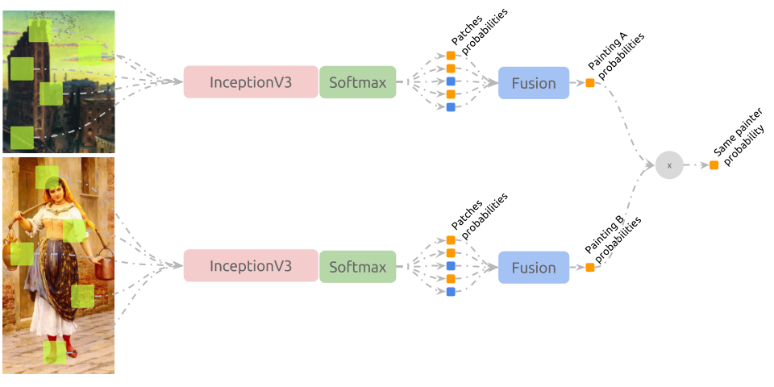
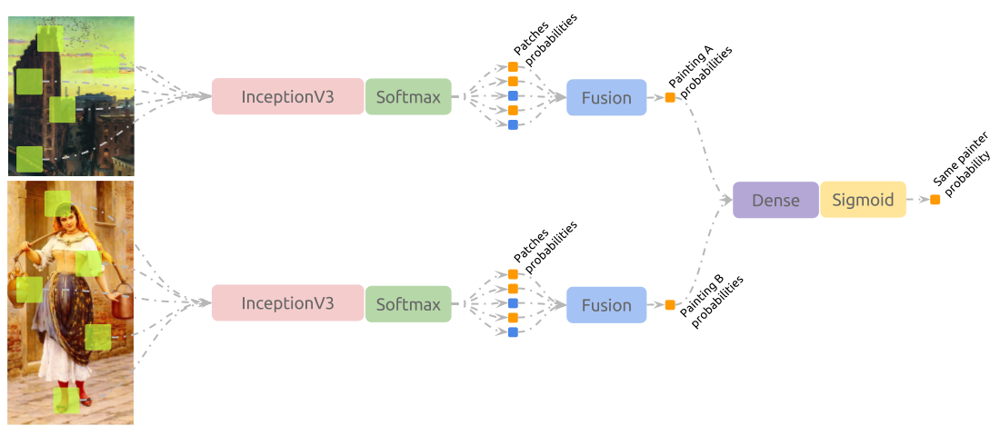

# Connoisseur

Machine Learning experiments on paintings.


“Battle of Grunwald”, Jan Matejko, 1878. From Public Domain.  
Available at: [wikiart.org/en/jan-matejko/battle-of-grunwald-1878](https://www.wikiart.org/en/jan-matejko/battle-of-grunwald-1878).

Check the [INSTALL.md](docs/INSTALL.md) file for instructions on how to
prepare your environment to run connoisseur.

## Running the experiments

After entering the virtual environment or initiating the docker container,
experiments can be found at the `/connoisseur/experiments` folder. An
execution example follows:

```shell
cd ./experiments/
python 1-extract-patches.py with batch_size=256 image_shape=[299,299,3] \
                                 dataset_name='VanGogh' \
                                 data_dir="./datasets/vangogh" \
                                 saving_directory="./datasets/vangogh/random_299/" \
                                 valid_size=.25
```

This experiment will download, extract and prepare van Gogh's dataset into the
`data_dir` directory. Finally, it will extract patches from all samples and
save them in `saving_directory`.

Each experiment is wrapped by [sacred](http://sacred.readthedocs.io/) package,
capable of monitoring an experiment and logging its progression to a database
or file. To do so, use the `m` or `F` parameter:

```shell
python 1-extract-patches.py -m 107.0.0.1:27017:experiments  # Requires MongoDB
python 1-extract-patches.py -F ./extract-patches/
```

## Reportage

### van Gogh's

van Gogh's dataset is composed by 264 train samples and 67 test samples,
discriminated by the non van Gogh (nvg) and van Gogh (vg) labels.

#### InceptionV3, PCA and SVM

So far, the method responsible for best classification accuracy in the test
set is as follows:


1. `1-extract-patches.py` is used to extract 50 random patches with sizes
(299, 299, 3) from each sample in train and test folders.
2. `4a-embed-patches.py` is executed. Using InceptionV3 architecture and
its weights trained over imagenet dataset, patches are embedded to a lower
dimensional space (cut-point is `GlobalAveragePooling2d(name='avg_pool')` layer).
3. `5-train-top-classifier` trains a PCA --> SVM pipeline that classifies
patches according to their labels.
4. `6-evaluate-fusion` fuses the answers from the model trained above over the
test dataset using each strategy (e.g. sum, mean, farthest, most_frequent) and
reports results. Best values are shown bellow:

   ```
   score using sum strategy: 0.955223880597

                 precision    recall  f1-score   support

             0       1.00      0.93      0.96        42
             1       0.89      1.00      0.94        25

   avg / total       0.96      0.96      0.96        67

   Confusion matrix:
       nvg  vg
   nvg 39    3
    vg  0   25

   samples incorrectly classified: nvg/nvg_10658644, nvg/nvg_10500055 and nvg/nvg_18195595.
   ```

### Painter by Numbers

Containing many paintings from 1564 painters, this dataset was made available
in Kaggle's [Painter-by-Numbers](https://www.kaggle.com/c/painter-by-numbers)
competition. We also have access to meta-data associated with the paintings
(e.g. style, genre and year created).

While we can interpret the training phase as a multiclass problem, the test
phase consists in deciding whether or not two paintings belonging to a same
artist.

Score is computed by ROC AUC between an estimated probabilities and the actual
label (0.0 or 1.0).

#### InceptionV3, PCA and SVM

The 100 first painters (sorted by their hash code) were considered and the
pipeline described in the [previous section](#van-goghs).


We can see from the train confusion matrix and the test report bellow that the
model performed well for the 100 artists selected in training, but clearly
overfitted the data and missed many samples associated with the label
`same-artist`.

```
score using most_frequent strategy: 0.892038742206

            precision    recall  f1-score   support

        0.0      0.99      0.90      0.94  21628697
        1.0      0.03      0.25      0.06    287350

avg / total      0.98      0.89      0.93  21916047


Confusion matrix:

                    different-painters same-painter
different-painters            19477643      2151054
      same-painter              215030        72320

samples incorrectly classified: unknown/79032, unknown/82441, unknown/86253,
..., unknown/90371, unknown/37590 and unknown/45863.
```

#### Fine-tuned InceptionV3

So far, the method responsible for best classification accuracy in the test
set is as follows:



1. `1-extract-patches.py` is used to extract 50 random patches with sizes
(299, 299, 3) from each sample in train and test folders.
2. `2-train-network.py` fine-tunes InceptionV3 (transfered from imagenet)
to the train dataset, associating patches to their respective painters.
4. `3a-generate-network-answers` feed-forwards each test painting's test
through the network trained in 2. Let `y` be the fined-tuned InceptionV3
and `a` and `b` be paintings in a pair described in `submission_info.csv`:
   - Patches probabilities are fused using each strategy, leaving us with the
     probabilities of a work belonging to each one of the 1584 painters. The
     probability of these being of a same painting is computed by
     `argmax(y(a)) == argmax(y(b))`. Results are shown bellow:

    ```
    score using sum strategy: 0.988578688483

                 precision    recall  f1-score   support

            0.0       0.99      1.00      0.99  21628697
            1.0       0.67      0.25      0.37    287350

    avg / total       0.99      0.99      0.99  21916047

    Confusion matrix:

                        different-painters same-painter
    different-painters            21593154        35543
          same-painter              214767        72583

    samples incorrectly classified: unknown/75211, unknown/46811,
    unknown/66309, ..., unknown/89706, unknown/61690, unknown/55879
    ```

    - Patches probabilities are fused using `mean` strategy, leaving us with the
      probabilities of a work belonging to each one of the 1584 painters. The
      probability of these being of a same painting is computed by
      `y(a).dot(y(b))`. Results are shown bellow:

      ```
      roc auc score using mean strategy: 0.902789501328

                   precision    recall  f1-score   support

              0.0       0.99      1.00      0.99  21628697
              1.0       0.95      0.09      0.16    287350

      avg / total       0.99      0.99      0.98  21916047

      Confusion matrix:

                          different-painters same-painter
      different-painters            21627458         1239
            same-painter              261844        25506

      samples incorrectly classified: unknown/154, unknown/12888, unknown/39773,
      ..., 'unknown/82178, unknown/38576 and unknown/35422.
      ```

#### Fine-tuned Siamese InceptionV3 (ongoing)

The pipeline presented in [Fine-tuned InceptionV3](#fine-tuned-inceptionv3) is
utilized once again here. However, the predictions from Inception+Softmax are not
directly combined with the dot product, but multiplied and fed to a dense network
that learns to discriminate between `different-painters` and `same-painter`.


